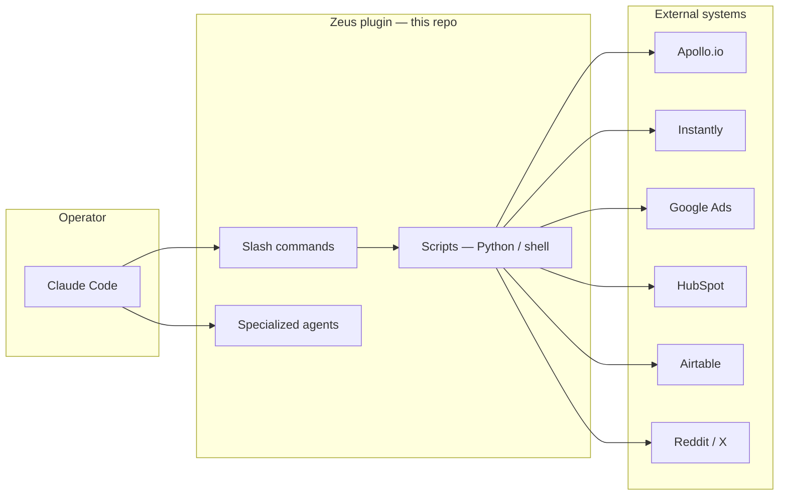
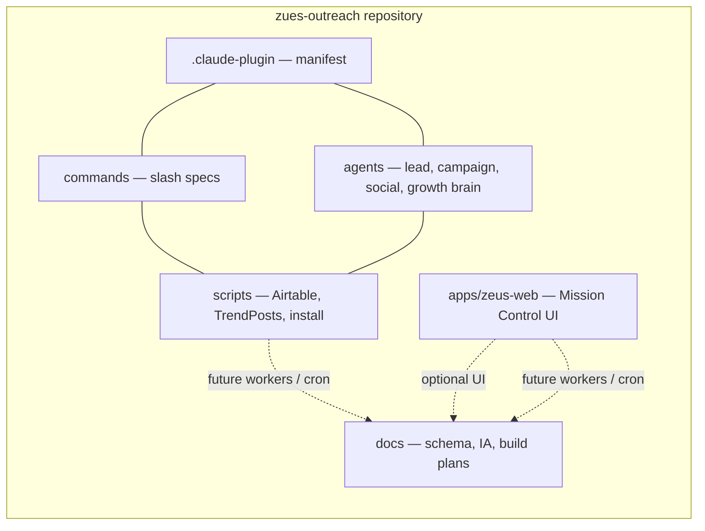
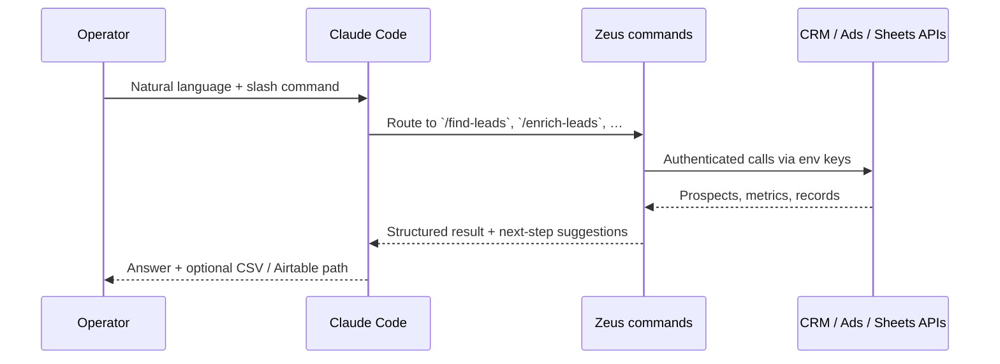

<p align="center">
  <strong>Zeus Growth OS</strong><br/>
  <sub>Claude Code execution layer · multi-brand growth stack · Airtable as pipeline brain</sub>
</p>

<p align="center">
  <a href="https://github.com/OliWoods-Org/zues-outreach/blob/main/.claude-plugin/plugin.json"></a>
  <a href=".claude-plugin/plugin.json"></a>
  <a href="https://github.com/OliWoods-Org/zues-outreach"></a>
  <a href="apps/zeus-web/README.md"></a>
</p>

---

## What this repository is

**Zeus** bundles outbound growth workflows: **lead discovery**, **enrichment**, **email campaigns**, **Google Ads** insight, **HubSpot** CRM sync, **social listening**, and **Airtable** as the structured pipeline. This repo ships primarily as a **Claude Code plugin** (slash commands, agents, docs) so operators run growth execution inside Claude Code without juggling ten browser tabs.

**Zeus Web** (`apps/zeus-web`) is the **glass / Siren-inspired dashboard** (Mission Control lanes, PPC/TNT surfaces, Growth routes). It is a **Vite + React** SPA and deploys separately from the plugin—for example via **Netlify** using the root [`netlify.toml`](netlify.toml) (`base = "apps/zeus-web"`).

**Elevar Health** is the reference vertical (men’s telehealth / partnerships); the same patterns apply to other product-line Airtable bases in the [Zeus Outreach](https://github.com/OliWoods-Org/zues-outreach) workspace.

---

## Visual overview

### Where Zeus sits in your stack



### Plugin vs dashboard vs workers



### Typical command journey



---

## Repository layout

High-signal paths only—full documentation lives under [`docs/`](docs/).

```
zues-outreach/
├── .claude-plugin/          # Plugin manifest (name: zues-outreach)
├── agents/                  # Subagent definitions (lead, campaign, social, growth brain)
├── commands/                # Slash command markdown — wired into Claude Code
├── apps/zeus-web/           # Vite/React Mission Control UI — Netlify base path in netlify.toml
├── scripts/                 # install.sh, airtable-push-leads.py, trendposts_append.py, pilots
├── snapshots/siren-ui-reference/   # Frozen UI reference for Zeus visual parity
├── docs/                    # Schema, IA, build plans, Airtable field guides
├── netlify.toml             # SPA redirects + build for Zeus Web
└── .env.example             # Copy to ~/.zeus-env — never commit secrets
```

---

## Slash commands (features)

| Command | What it does |
|---------|----------------|
| [`/zeus`](commands/zeus.md) | Index into Zeus docs and build tracks |
| [`/find-leads`](commands/find-leads.md) | Search Apollo.io by geography, title, company size, … |
| [`/enrich-leads`](commands/enrich-leads.md) | Enrich lists with phone, email, LinkedIn |
| [`/send-campaign`](commands/send-campaign.md) | Personalized sequences via Instantly |
| [`/ads-report`](commands/ads-report.md) | Google Ads performance summaries |
| [`/social-listen`](commands/social-listen.md) | Reddit/X keyword monitoring — feeds intelligence lane / TrendPosts patterns |
| [`/crm-sync`](commands/crm-sync.md) | Push leads into HubSpot |
| [`/airtable-sync`](commands/airtable-sync.md) | Upsert leads into a scoped outreach base — dedupe by Email |

Dry-run example before touching Airtable:

```bash
python3 scripts/airtable-push-leads.py leads.csv --dry-run
```

---

## Zeus Web (Mission Control UI)

The dashboard mirrors **Growth OS lanes** (Listen → Target → Engage → Convert → Report) plus PPC/TNT, social, voice, and guard surfaces.

| Area | Routes | Notes |
|------|--------|--------|
| Lanes | `/listen`, `/target`, `/engage`, `/convert`, `/report` | Tier/listen UI; some stubs |
| Growth | `/publish`, `/influencers`, `/brand`, `/brand/wizard`, `/affiliates`, `/marketplace`, `/briefings` | Affiliates & Briefings carry richer mocks |
| PPC (TNT) | `/ppc`, `/ppc/:agentId` | Agent metadata in app source |
| Social | `/social/activity`, `/social/autopost`, `/social/replies` | Activity mocks |
| Voice / ops | `/campaigns`, `/pipeline`, `/analytics`, `/scripts`, `/settings` | Growth coach lives under Mission `/chat` |
| Guard | `/guard` | Guard mode |

**Run locally**

```bash
cd apps/zeus-web
npm install
npm run dev
```

Default dev server: **http://127.0.0.1:5173** (change the port in Vite if you run Siren on the same machine).

**Production build (Netlify / static host)**

The root [`netlify.toml`](netlify.toml) sets `base = "apps/zeus-web"`, `publish = "dist"`, and SPA `/* → /index.html`. Your live URL is on the **Netlify site dashboard** (Domain settings) for the linked site— it is not hardcoded in this repository.

IA and module detail: [`docs/ZEUS_MISSION_CONTROL_IA.md`](docs/ZEUS_MISSION_CONTROL_IA.md) · App README: [`apps/zeus-web/README.md`](apps/zeus-web/README.md).

---

## Agents (subagents)

| Agent | Role |
|-------|------|
| [`lead-prospector`](agents/lead-prospector.md) | Lead research and scoring |
| [`campaign-builder`](agents/campaign-builder.md) | Email sequences from briefs |
| [`social-monitor`](agents/social-monitor.md) | Social listening and opportunities |
| [`growth-brain`](agents/growth-brain.md) | Cross-channel optimizer — reads TrendPosts / metrics; proposes `OptimizationSuggestions` (human approval, no auto-apply of regulated changes) |

---

## Installation

### Prerequisites

- [Claude Code](https://www.anthropic.com/claude-code) installed globally (`npm install -g @anthropic-ai/claude-code`)
- API keys only for integrations you plan to use

### One-line install

```bash
curl -fsSL https://raw.githubusercontent.com/OliWoods-Org/zues-outreach/main/scripts/install.sh | bash
```

See [`scripts/install.sh`](scripts/install.sh) for full behavior (paths, plugin directory naming).

### Manual install

```bash
mkdir -p ~/.claude/plugins
git clone https://github.com/OliWoods-Org/zues-outreach.git ~/.claude/plugins/zues-outreach

cp ~/.claude/plugins/zues-outreach/.env.example ~/.zeus-env
# Edit ~/.zeus-env with your keys
echo "source ~/.zeus-env" >> ~/.zshrc
source ~/.zshrc
```

**Legacy path:** installs under `~/.claude/plugins/elevare-plugin` remain valid if you pull `main` from this repo; new installs use `zues-outreach` per `scripts/install.sh`.

---

## Environment variables

Copy [`.env.example`](.env.example) to `~/.zeus-env` (or `~/.elevare-env`). Scope **Airtable PATs to a single outreach base**—do not use an all-bases token for pipeline scripts.

| Integration | Variables (see `.env.example`) |
|-------------|--------------------------------|
| Apollo | `APOLLO_API_KEY` |
| Instantly | `INSTANTLY_API_KEY` |
| Google Ads | `GOOGLE_ADS_CLIENT_ID`, `GOOGLE_ADS_CLIENT_SECRET`, `GOOGLE_ADS_REFRESH_TOKEN`, `GOOGLE_ADS_CUSTOMER_ID`, `GOOGLE_ADS_DEVELOPER_TOKEN` |
| HubSpot | `HUBSPOT_API_KEY` |
| Airtable | `AIRTABLE_PAT`, `AIRTABLE_BASE_ID`, optional table/campaign/merge field overrides |
| Reddit | `REDDIT_*` (client id/secret, user credentials as documented) |
| X / Twitter | `TWITTER_BEARER_TOKEN` (optional listen features) |

TrendPosts and tier caps have optional env hints at the top of `.env.example` for worker-style flows described in the docs.

---

## Usage examples

### Open the Zeus index

```
/zeus plan
```

### Find leads

```
/find-leads wellness clinics in Texas
/find-leads pharmacies in California with 10+ employees
```

### Sync to Airtable after export

```
/airtable-sync leads.csv
```

---

## Documentation map

Master checklist and deep references:

| Document | Purpose |
|----------|---------|
| [`docs/CLAUDE_TASKS.md`](docs/CLAUDE_TASKS.md) | Claude Code checklist by track |
| [`docs/ZEUS_FINAL_BUILD_PLAN.md`](docs/ZEUS_FINAL_BUILD_PLAN.md) | Phased execution — Mission Control, Airtable, workers, gates |
| [`docs/ZEUS_OUTREACH_PLAN.md`](docs/ZEUS_OUTREACH_PLAN.md) | Portfolio bases, Listen vs responder, Growth Brain, v2 |
| [`docs/AIRTABLE_ZEUS_SCHEMA.md`](docs/AIRTABLE_ZEUS_SCHEMA.md) | Table and field reference |
| [`docs/ZEUS_MISSION_CONTROL_IA.md`](docs/ZEUS_MISSION_CONTROL_IA.md) | Information architecture |
| [`docs/TNT_LOCAL_PREVIEW.md`](docs/TNT_LOCAL_PREVIEW.md) | TNT / FastAPI local preview |
| [`docs/ELEVAR_OUTREACH_AIRTABLE.md`](docs/ELEVAR_OUTREACH_AIRTABLE.md) | Elevar `Leads` table, Apollo pilot script |
| [`docs/SOCIAL_LISTEN_TIERS.md`](docs/SOCIAL_LISTEN_TIERS.md) | Listen metering vs AI responder |
| [`docs/GROWTH_BRAIN_OPTIMIZER.md`](docs/GROWTH_BRAIN_OPTIMIZER.md) | Cross-channel optimizer narrative |

Additional specs (pricing SKUs, affiliate module, mobile UX, low-budget stack, backlog decisions) are indexed from the same [`docs/`](docs/) tree—start from **CLAUDE_TASKS** or **ZEUS_FINAL_BUILD_PLAN** if you are onboarding engineering.

---

## Support

**Matt Woods** — Good Companies / OliWoods. Internal context: Elevare / Zeus workspace in Notion where applicable.

---

<p align="center">
  <sub>Built for operators who want growth execution <strong>in the IDE</strong>, with Airtable and Mission Control as the system of record.</sub>
</p>
