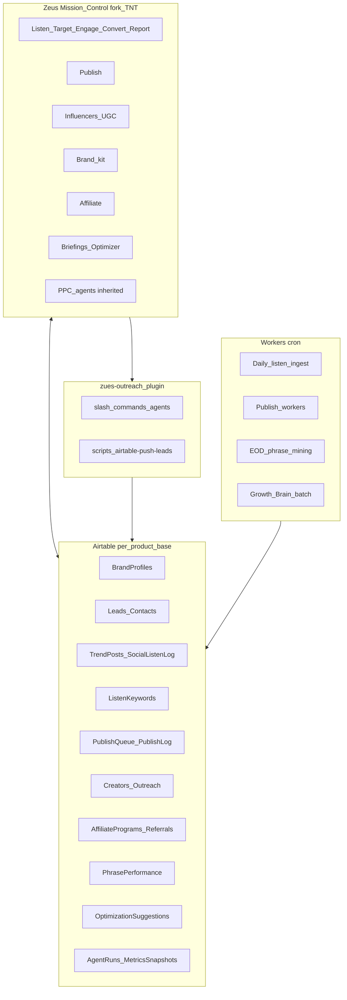

# Zeus Growth OS — Final build plan (execution source of truth)

This document is the **killer, no-detail-dropped** roadmap to ship **Zeus**: one sellable **Growth OS** with **Mission Control** (dashboard), **Airtable-first data plane**, **execution layer** ([zues-outreach](https://github.com/OliWoods-Org/zues-outreach) Claude plugin), workers for **publish/listen/brain**, and **tiered pricing**. Narrative and portfolio rules remain in [`ZEUS_OUTREACH_PLAN.md`](ZEUS_OUTREACH_PLAN.md); **this file** is what engineering and GTM execute against.

**Principles**

1. **Per-product Airtable bases** for pipeline hygiene — not one mega-base (see planning doc §1, §4).
2. **Social listen (intelligence)** and **AI responder** are **separate products** that connect; **metered** listen logging and **responder** actions are **separately billable**.
3. **PPC agents** and paid UX come from **forking the TNT dashboard** — do not rewrite from zero.
4. **Approval gates** for paid media, health/finance copy, and auto-post by default.
5. **Growth Brain** starts as **LLM + rules + structured logs**; add classical ML when `MetricsSnapshots` + `AgentRuns` volume justifies it.

---

## 1. What we are building (product shape)

| Surface | Role |
|---------|------|
| **Zeus Mission Control** | Web app: fork of **TNT** + extended IA (Listen, Target, Engage, Convert, Report, **Publish**, **Influencers/UGC**, **Brand kit**, **Affiliate**, **Briefings**, **Optimizer**). |
| **Airtable (per brand/product base)** | System of record: leads, brand, listen logs, publish queue, creators, affiliates, suggestions, audit logs. |
| **zues-outreach (this repo)** | Claude Code **execution layer**: find/enrich/campaign/ads/CRM/**airtable-sync**/**social-listen**; agents. |
| **Job runners / workers** | Dequeue `PublishQueue`, daily **TrendPosts** ingest, EOD **PhrasePerformance** mining, **Growth Brain** batch jobs — deploy as your stack prefers (Cloudflare Workers, Railway, cron + scripts). |

---

## 2. Architecture (control plane + data plane + workers)

---

## 3. Parallel tracks (who builds what)

| Track | Repo / location | Deliverables |
|-------|-----------------|--------------|
| **A — Mission Control** | New repo: fork **TNT** → `zeus-mission-control` (name TBD) | Auth, nav, PPC surfaces preserved; new routes/modules per phase; Airtable + ads APIs. |
| **B — Airtable schemas** | Each product base + [`AIRTABLE_ZEUS_SCHEMA.md`](AIRTABLE_ZEUS_SCHEMA.md) | Create/link tables; views for Briefings; scoped PATs per base. |
| **C — Execution layer** | **This repo** [`zues-outreach`](https://github.com/OliWoods-Org/zues-outreach) | Commands/scripts aligned to Zeus tables; env docs; optional `listen-log` / `publish-queue` helpers. |
| **D — Social publish** | Workers repo or MAMA integration | OAuth vault; Meta/X/TikTok/Reddit adapters; `post(job)` interface. |
| **E — Listen ingest** | Workers + [`social-listen`](commands/social-listen.md) patterns | Tier caps; append **TrendPosts**; dedupe. |
| **F — Growth Brain** | Workers + Mission Control UI | Read logs → write `OptimizationSuggestions`; hook library refresh; persona hypotheses. |
| **G — Affiliate** | Mission Control + Airtable + payments later | Programs, links, events, `RewardsQueue`; Stripe Connect phase later. |

Tracks **A + B** unblock everything else; **C** ships in parallel once **B** has minimal `Leads` + `BrandProfiles` + `TrendPosts` stubs.

---

## 4. Phase gates (order + acceptance criteria)

### Phase 0 — Decisions & inventory (1–2 weeks calendar, mostly async)

| # | Task | Done when |
|---|------|-----------|
| 0.1 | Confirm **MAMA MCP Marketplace**: separate base vs **Track** field in MAMA Outreach | Written decision in Notion or planning doc |
| 0.2 | **GoodBot vs 411** product truth | One narrative; outreach base story updated |
| 0.3 | **Locate MAMA X autoposter** | Doc: repo path, auth pattern, post API — input to Track D |
| 0.4 | **DOM CRE** scope | Internal vs partner; outreach base yes/no |
| 0.5 | Name **Mission Control** repo + deployment target | Repo created; staging URL plan |

**Exit gate:** 0.3 documented (can be “not found — greenfield poster” with rationale).

---

### Phase 1 — Mission Control shell (Track A)

| # | Task | Done when |
|---|------|-----------|
| 1.1 | Fork **TNT** to Zeus app; CI builds | Green build; env example |
| 1.2 | Preserve **PPC agent** routes and core ads reporting | Manual QA vs current TNT |
| 1.3 | Add top-level nav placeholders: Listen, Target, Engage, Convert, Report, Publish, Brand, Affiliates, Briefings | Routes render (can be stub data) |
| 1.4 | Integrate **one** Airtable base read-only: `Leads` summary view | Table shows row count + last sync |

**Exit gate:** stakeholders see Zeus-branded shell + PPC parity.

---

### Phase 2 — Airtable foundation (Track B)

| # | Task | Done when |
|---|------|-----------|
| 2.1 | Per product base: `Companies`/`Products`/`Projects` (minimal hierarchy) | Linked records work |
| 2.2 | `BrandProfiles` + link to Product | Required fields per [`AIRTABLE_ZEUS_SCHEMA.md`](AIRTABLE_ZEUS_SCHEMA.md) |
| 2.3 | `Leads` + merge key (Email) — Elevar spec already: [`ELEVAR_OUTREACH_AIRTABLE.md`](ELEVAR_OUTREACH_AIRTABLE.md) | `/airtable-sync` still works |
| 2.4 | Stub tables: `TrendPosts`, `ListenKeywords`, `PublishQueue`, `OptimizationSuggestions`, `AgentRuns` | Empty OK; field types locked |

**Exit gate:** Mission Control can read **Leads** + **BrandProfiles** from PAT-scoped base.

---

### Phase 3 — Execution layer hardening (Track C — this repo)

| # | Task | Done when |
|---|------|-----------|
| 3.1 | README + plugin manifest = **Zeus Growth OS** (Elevare = vertical example) | Merged |
| 3.2 | `.env.example` documents Zeus-scoped vars + optional listen tier placeholders | Merged |
| 3.3 | `/zeus` command index points to build docs | [`commands/zeus.md`](../commands/zeus.md) |
| 3.4 | (Optional next PR) Script: CSV → `TrendPosts` mock OR document worker contract | Spec in schema doc |

**Exit gate:** new dev clones repo and understands Zeus vs Elevar in <15 min.

---

### Phase 4 — Publish queue + workers v1 (Track D)

| # | Task | Done when |
|---|------|-----------|
| 4.1 | `PublishQueue` / `PublishLog` schema finalized | Airtable + doc |
| 4.2 | Worker: **Meta + X** post approved rows | 10 successful test posts (staging) |
| 4.3 | Dashboard: queue view + approve/reject | Rows move status |
| 4.4 | Phase **Threads, Reddit, TikTok** | Per API readiness; document blockers |

**Exit gate:** one product can schedule approved posts to **two** channels.

---

### Phase 5 — Listen intelligence + tiers (Track E)

| # | Task | Done when |
|---|------|-----------|
| 5.1 | Daily job: ingest trending/search results into `TrendPosts` with **dedupe** | Row cap enforced per tier |
| 5.2 | `ListenKeywords` CRUD in Mission Control | Keywords drive ingest |
| 5.3 | **Pricing:** expose Listen Pro / Enterprise caps (product marketing + feature flags) | Doc + config |
| 5.4 | Dashboard: velocity charts + theme clustering (v1 can be table + tag) | Demo-able |

**Exit gate:** daily Airtable growth visible; **listen** billed separately from **responder**.

---

### Phase 6 — AI responder + EOD phrase mining (Track C/E)

| # | Task | Done when |
|---|------|-----------|
| 6.1 | Responder drafts logged with **approval** flag | No silent send for regulated tier |
| 6.2 | EOD job: aggregate replies → **PhrasePerformance** top phrases | Table populated |
| 6.3 | Mission Control: “top phrases” widget | Reads `PhrasePerformance` |

**Exit gate:** Brain has **conversion language** signal.

---

### Phase 7 — Growth Brain v1 (Track F)

| # | Task | Done when |
|---|------|-----------|
| 7.1 | Nightly/weekly job: inputs = TrendPosts + PPC exports + PhrasePerformance + PublishLog | Job spec documented |
| 7.2 | Output rows → `OptimizationSuggestions` (type: PPC / SEO / Hook / Persona) | Human approval column required |
| 7.3 | **Notebook LLM / SEO brief** suggestions ranked | At least one product dogfoods |
| 7.4 | `AgentRuns` logs every batch | Audit trail works |

**Exit gate:** one **approved** suggestion traced end-to-end.

---

### Phase 8 — Affiliate / referral (Track G)

| # | Task | Done when |
|---|------|-----------|
| 8.1 | Tables: AffiliatePrograms, ReferralLinks, ReferralEvents, RewardsQueue | Schema live |
| 8.2 | Partner enrollment UI + link generator | Creates rows |
| 8.3 | Attribution v1: UTM + first-touch row | Tests pass |
| 8.4 | Payout automation | Phase 8b: Stripe Connect (optional) |

**Exit gate:** referral signup → event → **RewardsQueue** manual payout tested.

---

### Phase 9 — Branding-first onboarding (Track A + B)

| # | Task | Done when |
|---|------|-----------|
| 9.1 | Wizard: chat → logo → tokens → **BrandProfiles** | New product onboarded in <30 min |
| 9.2 | Generated **brand guidelines** artifact (PDF/Markdown/Google Doc link) | Stored on profile |
| 9.3 | Templates unlocked: email + social + influencer | Merge fields from profile |

**Exit gate:** posts/outreach pull voice from **BrandProfiles** only.

---

### Phase 10 — Briefings + optimizer UI (Track A)

| # | Task | Done when |
|---|------|-----------|
| 10.1 | Morning brief: new leads + why + overnight deltas | Push or in-app |
| 10.2 | Weekly strategy view: goals vs `MetricsSnapshots` | Chart/table |
| 10.3 | Approve/reject `OptimizationSuggestions` in bulk | Workflow complete |

**Exit gate:** exec runs week from Mission Control without spreadsheets.

---

### Phase 11 — Content factory (optional module)

| # | Task | Done when |
|---|------|-----------|
| 11.1 | Notebook research → plan rows | Linked to Product |
| 11.2 | Podcast → YouTube → clip agents | Governed approvals |
| 11.3 | Clip queue → `PublishQueue` | Same publish rail as Phase 4 |

**Exit gate:** one episode **dogfood** end-to-end.

---

### Phase 12 — v2 differentiators (pick 3–5 from planning §18)

Examples: **Compliance copilot**, **LP experiment loop**, **white-label**, **churn triggers**, **creative fatigue alerts**. Prioritize after Phase 10.

---

## 5. Pricing / packaging (engineering hooks)

| SKU | Includes |
|-----|----------|
| **Zeus Core** | Mission Control read; limited Listen ingest; manual publish |
| **Listen Pro** | Higher `TrendPosts`/day + keyword slots |
| **Responder Add-on** | AI drafts; metered sends |
| **Publish Pro** | Extra channels + queue depth |
| **Affiliate** | Programs + events; payouts tier |
| **Brain Pro** | Full optimizer + EOD mining |

Document feature flags in Mission Control config — align with stripe/billing when ready.

---

## 6. Risk register (short)

| Risk | Mitigation |
|------|------------|
| Platform API bans / policy | Channel phased rollout; approve-before-post |
| Airtable rate limits | Batch writes; sync queue; optional warehouse mirror later |
| Scope creep | Phase gates; v2 list frozen until Phase 10 done |
| Two dashboards (TNT vs Zeus) | Fork once; shared component lib later |

---

## 7. Current repo: what “done” means for Track C (this sprint)

The following are **landed in git** as part of “build it” baseline:

- [`ZEUS_FINAL_BUILD_PLAN.md`](ZEUS_FINAL_BUILD_PLAN.md) (this file)
- [`AIRTABLE_ZEUS_SCHEMA.md`](AIRTABLE_ZEUS_SCHEMA.md)
- [`commands/zeus.md`](../commands/zeus.md)
- README + `plugin.json` + `.env.example` aligned to **Zeus Growth OS**

Next PRs in **this repo** (optional): `scripts/` helpers for Airtable append to `TrendPosts`; field-map extensions in `airtable-push-leads.py` for multi-table — only after schema frozen in prod bases.

---

## 8. References

| Doc | Purpose |
|-----|---------|
| [`ZEUS_OUTREACH_PLAN.md`](ZEUS_OUTREACH_PLAN.md) | Portfolio bases, Listen vs responder, affiliate, Brain, §18 ideas |
| [`ELEVAR_OUTREACH_AIRTABLE.md`](ELEVAR_OUTREACH_AIRTABLE.md) | Elevar `Leads` concrete schema |
| [`AIRTABLE_ZEUS_SCHEMA.md`](AIRTABLE_ZEUS_SCHEMA.md) | Zeus cross-cutting tables & fields |
| [`commands/airtable-sync.md`](../commands/airtable-sync.md) | PAT isolation, upsert behavior |

---

*Version: 1.0 — aligns with Zeus planning sections §8–§18.*
